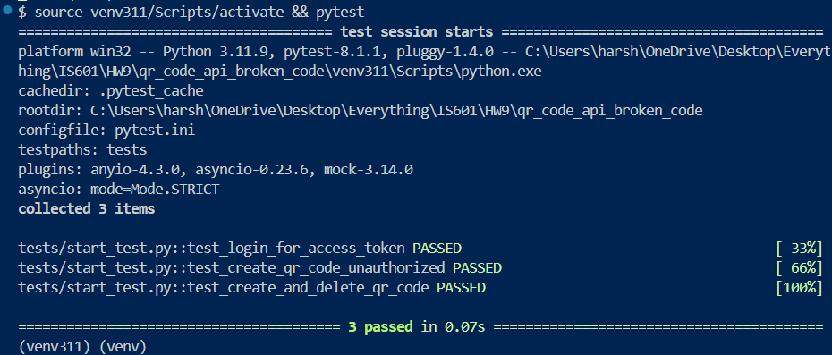
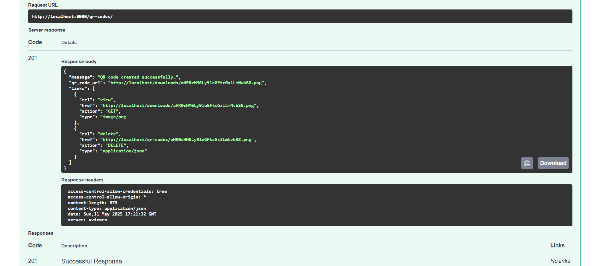

# QR Code REST API (FastAPI)

A secure, test-driven FastAPI application for generating, listing, and deleting QR codes with OAuth2 authentication. This project is ready for local development, testing, and CI/CD with GitHub Actions and Docker.

---

## Features
- **Create QR Codes:** Generate QR codes for any URL with custom colors and size.
- **List QR Codes:** Retrieve all generated QR codes.
- **Delete QR Codes:** Remove QR codes by filename.
- **OAuth2 Authentication:** Secure all endpoints with token-based authentication.
- **OpenAPI Docs:** Interactive API docs at `/docs` (after running the app).
- **Tested:** All endpoints covered by automated tests.
- **Docker & CI Ready:** Includes Dockerfile and GitHub Actions support.

---

## Quickstart

### 1. Clone & Setup
```bash
# Clone the repository
# cd into the project directory
python -m venv venv311
source venv311/Scripts/activate
pip install -r requirements.txt
```

### 2. Run Tests
```bash
source venv311/Scripts/activate
pytest
```

You should see all tests passing:



### 3. Run the App
```bash
uvicorn app.main:app --reload
```
Visit [http://localhost:8000/docs](http://localhost:8000/docs) for the interactive API documentation.

---

## Example: OpenAPI Docs Working

Below is a screenshot of the Swagger UI with the QR code API working:



---

## API Usage

- **Login:**
  - `POST /token` with form data: `username=admin`, `password=secret`
- **Create QR Code:**
  - `POST /qr-codes/` (requires Bearer token)
- **List QR Codes:**
  - `GET /qr-codes/` (requires Bearer token)
- **Delete QR Code:**
  - `DELETE /qr-codes/{filename}` (requires Bearer token)

---

## Environment Variables
You can override defaults by creating a `.env` file:
```
ADMIN_USER=admin
ADMIN_PASSWORD=secret
SECRET_KEY=your-secret-key
QR_CODE_DIR=./qr_codes
FILL_COLOR=red
BACK_COLOR=white
SERVER_BASE_URL=http://localhost:8000
SERVER_DOWNLOAD_FOLDER=downloads
```

---

## Docker
Build and run with Docker:
```bash
docker build -t qr-code-api .
docker run -p 8000:8000 qr-code-api
```

---

## GitHub Actions
- This project is ready for CI/CD. Add your workflow in `.github/workflows/` as needed.

---

## Production & Deployment Notes

- **Static QR Code Downloads:** The API now serves QR code images at `/downloads/{filename}`.
- **CORS:** Allowed origins can be set with the `CORS_ALLOWED_ORIGINS` environment variable (comma-separated). Default is `*` (all origins).
- **Secrets:** Always set `SECRET_KEY`, `ADMIN_USER`, and `ADMIN_PASSWORD` in your `.env` or as environment variables in production. Never use the defaults.
- **Gunicorn for Production:** The Docker container uses Gunicorn in production mode. Set `APP_ENV=production` to enable this.
- **Directory Permissions:** The `qr_codes` directory is owned by the app user and is not world-writable in production.
- **GitHub Actions:**
  - Update `.github/workflows/production.yml` with your DockerHub username/repo.
  - Inject secrets as environment variables for production deploys (see workflow comments).
- **HTTPS:** For production, run behind a reverse proxy (e.g., Nginx) that enforces HTTPS and serves as a gateway.

---

## Troubleshooting
- Use Python 3.11 for best compatibility.
- If you see build errors for `pydantic-core`, ensure you are **not** using Python 3.13+.
- For Windows, ensure you have Rust, Cargo, and MSVC v143 build tools installed.

---

## Credits
- Assignment for IS601, HW9
- Author: [Your Name]

---

## License
Apache 2.0